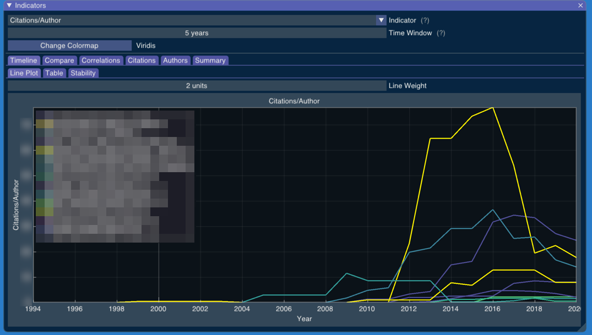
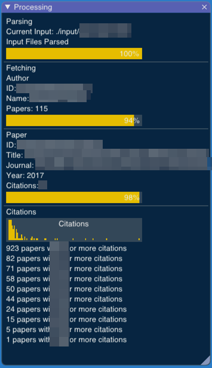
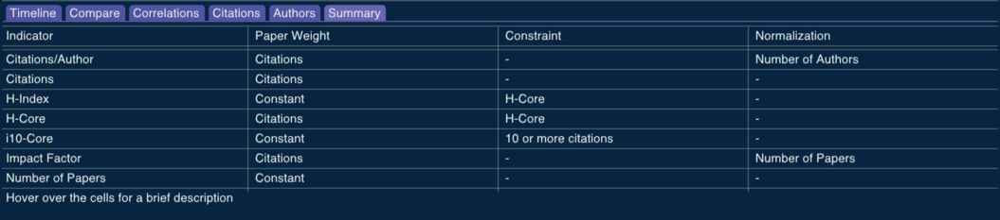
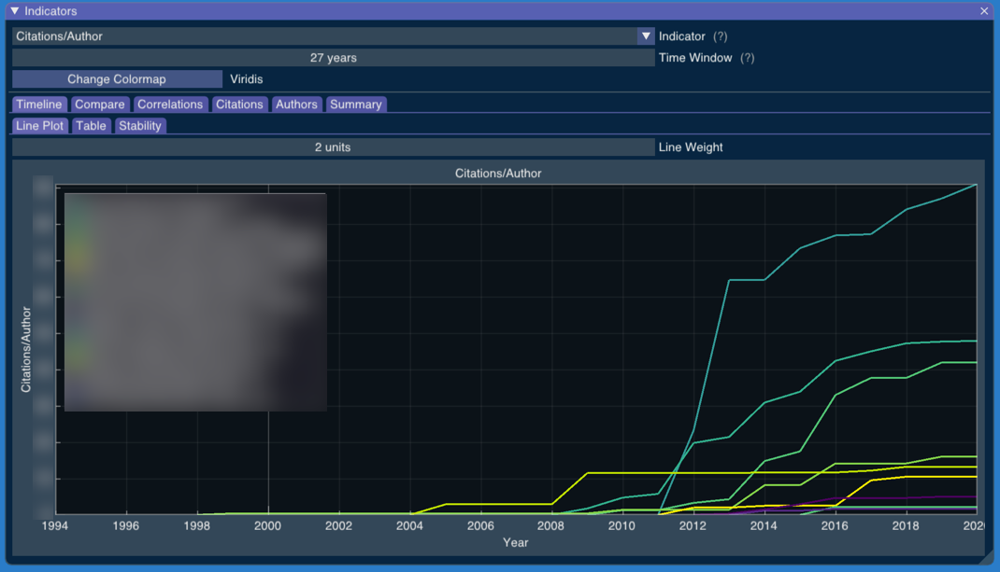
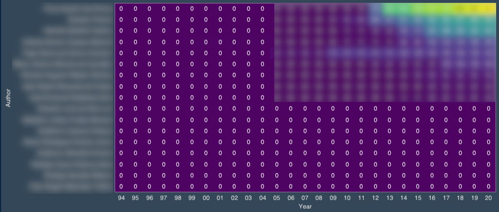
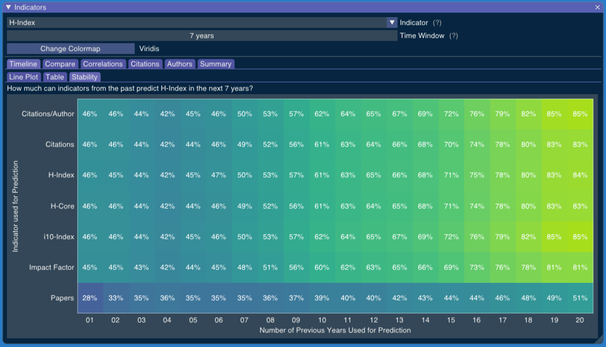
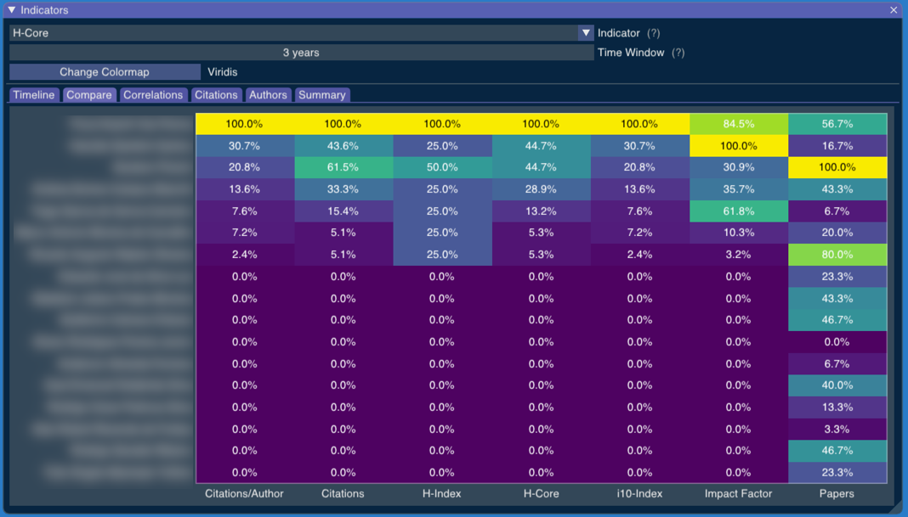
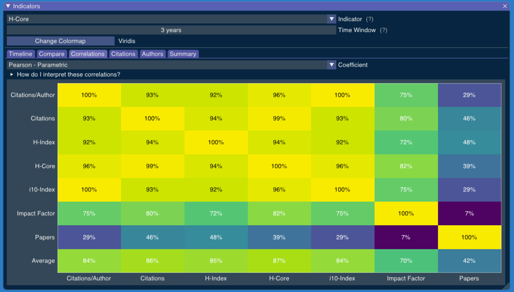
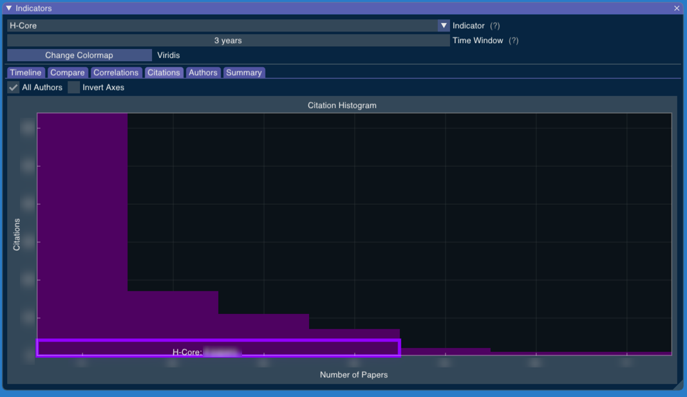

# BibExplorer 📚



Bibliography indicators are a crucial complement to peer reviews. The careless use of indicators reduces the motivation for high-impact publications, creates incentives for unethical practices, leads to injustices, wastes money, and consumes the time of the community. Still, adequate evaluation methods demand elaborate algorithms and treating large volumes of data from multiple data sources. BibExplorer is a tool to process curriculums, extract article meta-data from various APIs, and calculate indicators. BibExplorer can reveal how the various indicators have fluctuated over time with custom time windows, estimate which indicators adequately predict future productivity, contrast the outcomes of indicators, measure their correlation, and provide numerous visualization tools to explore this information.

<!-- START doctoc generated TOC please keep comment here to allow auto update -->
<!-- DON'T EDIT THIS SECTION, INSTEAD RE-RUN doctoc TO UPDATE -->
<!-- END doctoc generated TOC please keep comment here to allow auto update -->

## Examples

### Input formats

Create a directory for the CVs and save them in one of the following formats.

#### CSV

A CSV file should have the following columns:

* Author ID
* Author
* Paper ID
* Title
* Journal
* Year
* Authors
* Citations

See an example in [resource](resources/examples/input/ringo.csv). 

Even though there are columns for "Author ID" and "Author", a CSV file used as input should have information for a single author. This redundant information is used to make it compatible with the CSV files later generated to the output directory.

The "Authors" should be separated by commas so that BibExplorer can properly identify the number of authors in each paper.

#### JSON

A JSON file should have the following fields:

* Author ID
* Author
* Papers

See an example in [resource](resources/examples/input/satoshi.json). 

The "Author ID" field might have a number or a string. And "Papers" is a list of papers where each paper has the following fields:

* Paper ID
* Title
* Journal
* Year
* Authors
* Citations

The "Paper ID" can also be a string or a number. The "Authors" field should be a list of strings.

#### Lattes XML

XML files are parsed as CVs from the [lattes platform](http://buscatextual.cnpq.br/buscatextual/busca.do). To download a CV in XML  format from the platform, open a CV, and use the menu on the top right.


Or simply use the URL:

```
http://buscatextual.cnpq.br/buscatextual/download.do?metodo=apresentar&idcnpq=<lattes_id>
```

### Running BibExplorer

Use the "--input" (or "-i") option to define the input directory with CVs. For instance, if you keep the CVs in a directory `./input`, run BibExplorer with:

```bash
bibexplore --input ./input 
```

or simply

```bash
bibexplore --i ./input 
```

You can also use the `--output` (or `-o`) option to choose a directory for the results. Use the option `--help` (or `-h`) to see all other options.  Any option not provided in the command line will be replaced by an option in a `config.json` file.

BibExplorer will start processing all CVs. You can keep track of its progress with the "Processing" window:



For each paper, it will use the available APIs to look for information such as the number of citations the paper has.

As BibExplorer processes more papers, the indicators instantly become available in the "Indicators" window.


### Indicators

The bibliometric indicators are defined by (i) the weight we attribute to a paper, (ii) the constraints to even consider a paper, and (iii) the normalization strategy. The "Summary" tab includes a brief explanation for each indicator:



The indicator window can show each indicator from numerous perspectives.

### Timeline

The "Timeline" tab shows how indicators have changed over time for each researcher.


You can adjust the "Time Window" parameter to choose how many years are considered in an indicator. 



The wider the time window, the more stable the indicators should be. A maximum time window would show how much a researcher has produced up to that year.

The "Table" tab shows the same information in a heat table, which is better for comparisons rather than absolute values.



Researchers are sorted by their indicators in the last year.

### Stability

The "Stability" tab uses historical data to show how each indicator and each possible time window would perform if we used them to predict productivity according to the chosen combination of indicator and time window. 



In the example above, we have chosen the H-Index with a time window of 7 years. Using historical data, the table shows us how each combination of indicator and time window for the last years would fare to predict the H-Index of a researcher in the next 7 years.

For instance, the row "Impact Factor" and the column "06" gives us 45%. That means the Impact Factor of a researcher in the last 6 years has a non-parametric correlation of 45% with the H-Index of this author in the following 7 years. 

If we look at the rows, we see that "Papers" is a very bad predictor of a researcher "H-Index" in the next 7 years. If we look at the columns, we see that, for our database, longer time windows have always tended to always give us a better prediction of the researcher's H-Index in the next 7 years.

### Compare

The "Compare" tab shows us how the researchers have performed in the last years under all indicators.



The chosen indicator is used to sort results by that indicator. This helps us see if the results with the chosen indicator are much different from the results we would get from other indicators.

### Correlations

The "Correlations" tab shows us the similarity of results we get from the various indicators.



If we only want to know whether the indicators would give us different rankings for the researchers, we can choose a non-parametric correlation.


The last row tells us how good an indicator is at predicting all other indicators at once.

### Citations

The "Citations" tab shows the distribution of the number of citations considering all authors at once.



The histogram also shows the H-Core for this group of researchers. The H-Core is the number h of papers with at least h citations. 
 
## Install

### Packages

You can download the [binary packages from the CI artifacts](https://github.com/alandefreitas/BibExplorer/actions?query=workflow%3ABibExplorer+event%3Apush) or build the library [from the source files](#build-from-source).

For convenience, you might want to add the BibExplorer directory to "`PATH`": 

* [Windows](https://docs.alfresco.com/4.2/tasks/fot-addpath.html)
* [Linux](https://linuxize.com/post/how-to-add-directory-to-path-in-linux/)
* [Mac OS](https://www.architectryan.com/2012/10/02/add-to-the-path-on-mac-os-x-mountain-lion/)

### Build from source

#### Dependencies

This section lists the dependencies you need before installing BibExplorer from source:

* C++17
* CMake 3.14 or higher
* OpenGL
* Curl

<details>
    <summary>Instructions: Linux/Ubuntu/GCC</summary>
    
Check your GCC version

```bash
g++ --version
```

The output should be something like

```console
g++-8 (Ubuntu 8.4.0-1ubuntu1~18.04) 8.4.0
```

If you see a version before GCC-8, update it with

```bash
sudo apt update
sudo apt install gcc-8
sudo apt install g++-8
```

To update to any other version, like GCC-9 or GCC-10:

```bash
sudo apt install build-essential
sudo add-apt-repository ppa:ubuntu-toolchain-r/test
sudo apt-get update
sudo apt install g++-10
```

Once you installed a newer version of GCC, you can link it to `update-alternatives`. For instance, if you have GCC-7 and GCC-10, you can link them with:

```bash
sudo update-alternatives --install /usr/bin/gcc gcc /usr/bin/gcc-7 7
sudo update-alternatives --install /usr/bin/g++ g++ /usr/bin/g++-7 7
sudo update-alternatives --install /usr/bin/gcc gcc /usr/bin/gcc-10 10
sudo update-alternatives --install /usr/bin/g++ g++ /usr/bin/g++-10 10
```

You can now use `update-alternatives` to set you default `gcc` and `g++`:

```bash
update-alternatives --config g++
update-alternatives --config gcc
```

Check your CMake version:

```bash
cmake --version
```

If it's older than CMake 3.14, update it with

```bash
sudo apt upgrade cmake
```

or download the most recent version from [cmake.org](https://cmake.org/).

[Later](#build-the-examples) when running CMake, make sure you are using GCC-8 or higher by appending the following options:

```bash
-DCMAKE_C_COMPILER=/usr/bin/gcc-8 -DCMAKE_CXX_COMPILER=/usr/bin/g++-8
```

Install OpenGL / GLFW3:

```bash
sudo apt-get install libglfw3-dev
```

Install curl:

```bash
sudo apt install curl
sudo apt-get install libcurl4-gnutls-dev
```

Install OpenSSL:

```bash
sudo apt-get install libssl-dev
```

</details>

<details>
    <summary>Instructions: Mac Os/Clang</summary>

Check your Clang version:

```bash
clang --version
```

The output should be something like

```console
Apple clang version 11.0.0 (clang-1100.0.33.8)
```

If you see a version before Clang 11, update XCode in the App Store or update clang with homebrew. 

Check your CMake version:

```bash
cmake --version
```

If it's older than CMake 3.14, update it with

```bash
sudo brew upgrade cmake
```

or download the most recent version from [cmake.org](https://cmake.org/).

If the last command fails because you don't have [Homebrew](https://brew.sh) on your computer, you can install it with

```bash
/bin/bash -c "$(curl -fsSL https://raw.githubusercontent.com/Homebrew/install/master/install.sh)"
```

or you can follow the instructions in [https://brew.sh](https://brew.sh).

Download GLFW3 from https://www.glfw.org

Install OpenSSL:

```bash
brew install openssl
```

</details>

<details>
    <summary>Instructions: Windows/MSVC</summary>
    
* Make sure you have a recent version of [Visual Studio](https://visualstudio.microsoft.com)
* Install [Git](https://git-scm.com/download/win)
* Install [CMake](https://cmake.org/download/)
* Install [GLFW3](https://www.glfw.org)

Install [VCPKG](https://github.com/microsoft/vcpkg):

```bash
git clone https://github.com/microsoft/vcpkg
> .\vcpkg\bootstrap-vcpkg.bat
```

Install [libcurl](https://curl.haxx.se/download.html):

```bash
vcpkg install curl
```

</details>

Some other small dependencies, like header-only libraries, if not found, will be download at compile-time by the build script. You can see these dependencies in [source/CMakeLists.txt](source/CMakeLists.txt).

#### Build Only

This will build everything in `./build` directory:

```bash
mkdir build
cmake -version
cmake .. -DCMAKE_BUILD_TYPE=Release -DCMAKE_CXX_FLAGS="-O2"
cmake --build . -j 2 --config Release
```

On windows, replace `-O2` with `/O2`. You can replace `2` in `-j 2` with the number of cores in your computer.

#### Install from Source

This will install BibExplorer on your system:

```bash
mkdir build
cmake -version
cmake .. -DCMAKE_BUILD_TYPE=Release -DCMAKE_CXX_FLAGS="-O2" 
cmake --build . -j 2 --config Release
cmake --install .
```

On windows, replace `-O2` with `/O2`. You might need `sudo` for this last command.

#### Building the packages

This will create the binary packages you can use to install BibExplorer on your system:

```bash
mkdir build
cmake -version
cmake .. -DCMAKE_BUILD_TYPE=Release -DCMAKE_CXX_FLAGS="-O2"
cmake --build . -j 2 --config Release
cmake --install .
cpack .
```

On windows, replace `-O2` with `/O2`. You might need `sudo` for this last command.

## Limitations

We have not integrated many APIs yet. [`documentation/APIs.md`](documentation/APIs.md) includes a list of APIs we are considering with their pros and cons. 

The CSV and JSON input formats have a "Citations" field where one can directly enter the number of citations for each paper. This can be used to mitigate this lack of APIs. 

We currently use the Microsoft Academic API but it seems to be very limited to find data about most papers. We are still studying which APIs could provide us with more useful data.

## Contributing

There are many ways in which you can contribute to this library:

* Testing the library in new environments <sup>see [1](https://github.com/alandefreitas/bibexplorer/issues?q=is%3Aopen+is%3Aissue+label%3A%22cross-platform+issue+-+windows%22), [2](https://github.com/alandefreitas/bibexplorer/issues?q=is%3Aopen+is%3Aissue+label%3A%22cross-platform+issue+-+linux%22), [3](https://github.com/alandefreitas/bibexplorer/issues?q=is%3Aopen+is%3Aissue+label%3A%22cross-platform+issue+-+macos%22) </sup>
* Including new indicators <sup>see [1](#indicators)</sup>
* Integrating new APIs <sup>see [1](#limitations)</sup>
* Improving this documentation <sup>see [1](https://github.com/alandefreitas/bibexplorer/issues?q=is%3Aopen+is%3Aissue+label%3A%22enhancement+-+documentation%22) </sup>
* Finding bugs in general <sup>see [1](https://github.com/alandefreitas/bibexplorer/issues?q=is%3Aopen+is%3Aissue+label%3A%22bug+-+compilation+error%22), [2](https://github.com/alandefreitas/bibexplorer/issues?q=is%3Aopen+is%3Aissue+label%3A%22bug+-+compilation+warning%22), [3](https://github.com/alandefreitas/bibexplorer/issues?q=is%3Aopen+is%3Aissue+label%3A%22bug+-+runtime+error%22), [4](https://github.com/alandefreitas/bibexplorer/issues?q=is%3Aopen+is%3Aissue+label%3A%22bug+-+runtime+warning%22)</sup>
* Whatever idea seems interesting to you

If contributing with code, please leave the pedantic mode ON (`-DBUILD_WITH_PEDANTIC_WARNINGS=ON`). This helps us ensure the software works with other compilers and operating systems.

<details>
    <summary>Example: CLion</summary>
    

    
</details>

### Contributors

<!-- readme: collaborators,contributors -start --> 
<!-- readme: collaborators,contributors -end -->

## References

These are some references we used for this work:

1)  G. Abramo, T. Cicero, and C. A. D’Angelo. Assessing the varying level of impact measurement accuracy as a function of the citation window length. Journal of Informetrics, 5(4):659–667, 2011.
2)  D. E. Acuna, S. Allesina, and K. P. Kording. Future impact: Predicting scientific success. Nature, 489(7415):201, 2012.
3)  A. A. Agrawal. Corruption of journal impact factors. TRENDS in Ecology and Evolution, 20(4):157, 2005.
4)  S. Alonso, F. Cabrerizo, E. Herrera-Viedma, and F. Herrera. hg-index: A new index to characterize the scientific output of researchers based on the h-and g-indices. Scientometrics, 82(2):391–400, 2009.
5)  S. Alonso, F. J. Cabrerizo, E. Herrera-Viedma, and F. Herrera. h-index: A review focused in its variants, computation and standardization for different scientific fields. Journal of informetrics, 3(4):273–289, 2009.
6)  V. Anauati, S. Galiani, and R. H. Gálvez. Quantifying the life cycle of scholarly articles across fields of economic research. Economic Inquiry, 54(2):1339–1355, 2016.
7)  T. Anderson, R. Hankin, and P. Killworth. Beyond the durfee square: Enhancing the h-index to score total publication output. Scientometrics, 76(3):577–588, 2008.
8)  J. Bar-Ilan. Which h-index?—a comparison of wos, scopus and google scholar. Scientometrics, 74(2):257–271, 2008.
9)  C. Bartneck and S. Kokkelmans. Detecting h-index manipulation through self- citation analysis. Scientometrics, 87(1):85–98, 2010.
10)  P. D. Batista, M. G. Campiteli, and O. Kinouchi. Is it possible to compare resear- chers with different scientific interests? Scientometrics, 68(1):179–189, 2006.
11)  C. W. Belter. Bibliometric indicators: opportunities and limits. Journal of the Medical Library Association: JMLA, 103(4):219, 2015.
12)  C. T. Bergstrom and J. D. West. Assessing citations with the eigenfactorTM metrics, 2008.
13)  C. T. Bergstrom, J. D. West, and M. A. Wiseman. The eigenfactorTM metrics. Journal of neuroscience, 28(45):11433–11434, 2008.
14)  J. Bollen, M. A. Rodriguez, and H. Van de Sompel. Mesur: Usage-based metrics of scholarly impact. In Proceedings of the 7th ACM/IEEE-CS Joint Conference on Digital Libraries, JCDL ’07, pages 474–474, New York, NY, USA, 2007. ACM.
15)  G. J. Borjas and K. B. Doran. Prizes and productivity how winning the fields medal affects scientific output. Journal of human resources, 50(3):728–758, 2015. 
16)  L. Bornmann. Scientific peer review. Annual review of information science and
technology, 45(1):197–245, 2011.
17)  L.BornmannandH.-D.Daniel.Whatdoweknowaboutthehindex?Journalof
the American Society for Information Science and technology, 58(9):1381–1385, 2007.
18)  L. Bornmann and H.-D. Daniel. What do citation counts measure? a review of studies on citing behavior. Journal of documentation, 64(1):45–80, 2008.
19)  L. Bornmann, R. Mutz, and H.-D. Daniel. Are there better indices for evaluation purposes than the h index? a comparison of nine different variants of the h index using data from biomedicine. Journal of the American society for information science and technology, 59(5):830–837, 2008.
20)  L. Bornmann, R. Mutz, and H.-D. Daniel. The h index research output measurement: Two approaches to enhance its accuracy. Journal of Informetrics, 4(3):407–414, 2010.
21)  L. Bornmann, R. Mutz, S. E. Hug, and H.-D. Daniel. A multilevel meta-analysis of studies reporting correlations between the h index and 37 different h index variants. Journal of Informetrics, 5(3):346–359, 2011.
22)  M. Bras-Amorós, J. Domingo-Ferrer, and V. Torra. A bibliometric index based on the collaboration distance between cited and citing authors. Journal of Informetrics, 5(2):248–264, 2011.
23)  Q.L.Burrell.Ontheh-index,thesizeofthehirschcoreandjin’sa-index.Journal
of Informetrics, 1(2):170–177, 2007.
24)  E. Callaway. Beat it, impact factor! publishing elite turns against controversial metric. Nature News, 535(7611):210, 2016.
25)  P. Campbell. Not-so-deep impact. Nature, 435(77045):1003–1004, 2005.
26)  S. Chamberlain. Consuming article-level metrics: Observations and lessons. Information Standards Quarterly, 25(2):4–13, 2013.
27)  J. Chavda and A. Patel. Measuring research impact: bibliometrics, social media, altmetrics, and the bjgp. Br J Gen Pract, 66(642):e59–e61, 2016.
28)  F.S.ChewandA.Relyea-Chew.Howresearchbecomesknowledgeinradiology: an analysis of citations to published papers. American Journal of Roentgenology, 150(1):31–37, 1988.
29)  S.ColeandJ.R.Cole.Scientificoutputandrecognition:Astudyintheoperation
of the reward system in science. American sociological review, pages 377–390, 1967.
30)  S. Corneliussen. Bad summer for the journal impact factor. Physics Today, 2016.
31) B. Crew. Google Scholar reveals its most influential papers for 2019. https://www.natureindex.com/news-blog/google-scholar-reveals-most-influential-papers-research-citations-twenty-nineteen, 2019. Online; accessed 19-December-2019.
32)  S. N. Dorogovtsev and J. F. Mendes. 11(11):882, 2015.
Ranking scientists. Nature Physics,
33)  V. Durieux and P. A. Gevenois. Bibliometric indicators: quality measurements of scientific publication. Radiology, 255(2):342–351, 2010.
34)  P. M. Editors et al. The impact factor game, 2006.
35)  L. Egghe. Theory and practise of the g-index. Scientometrics, 69(1):131–152, 2006.
36)  L.EggheandR.Rousseau.Anh-indexweightedbycitationimpact.Information
Processing & Management, 44(2):770–780, 2008.
37)  C.Franzoni,G.Scellato,andP.Stephan.Changingincentivestopublish.Science,
333(6043):702–703, 2011.
38)  E. Garfield. Is citation analysis a legitimate evaluation tool? Scientometrics, 1(4):359–375, 1979.
39)  E. Garfield and I. H. Sher. New factors in the evaluation of scientific literature through citation indexing. American documentation, 14(3):195–201, 1963.
40)  Google. Google Scholar Top Publications. https://scholar.google.com/citations?view_op=top_venues, 2019. Online; accessed 19-December-2019.
41)  S. Haustein and V. Larivière. The use of bibliometrics for assessing research: Possibilities, limitations and adverse effects. In Incentives and performance, pages 121–139. Springer, 2015.
42)  S. Haustein, I. Peters, C. R. Sugimoto, M. Thelwall, and V. Larivière. Tweeting biomedicine: An analysis of tweets and citations in the biomedical literature. Journal of the Association for Information Science and Technology, 65(4):656– 669, 2014.
43)  D. Hicks, P. Wouters, L. Waltman, S. De Rijcke, and I. Rafols. Bibliometrics: the leiden manifesto for research metrics. Nature News, 520(7548):429, 2015.
44)  J. E. Hirsch. An index to quantify an individual’s scientific research output. Proceedings of the National academy of Sciences, 102(46):16569–16572, 2005.
45)  J. E. Hirsch. Does the h index have predictive power? Proceedings of the National Academy of Sciences, 104(49):19193–19198, 2007.
46)  B. Jin. H-index: an evaluation indicator proposed by scientist. Science Focus, 1(1):8–9, 2006.
47)  B. Jin, L. Liang, R. Rousseau, and L. Egghe. The r-and ar-indices: Complementing the h-index. Chinese science bulletin, 52(6):855–863, 2007.
48)  J. S. Katz and D. Hicks. How much is a collaboration worth? a calibrated bibliometric model. Scientometrics, 40(3):541–554, 1997.
49)  J. Kaur, F. Radicchi, and F. Menczer. Universality of scholarly impact metrics. Journal of Informetrics, 7(4):924–932, 2013.
50)  V. Kiermer, V. Larivière, and C. MacCallum. Measuring up: Impact factors do not reflect article citation rates, 2016.
51)  M. Kosmulski. A new hirsch-type index saves time and works equally well as the original h-index. ISSI newsletter, 2(3):4–6, 2006.
52)  C. Labbé. Ike antkare one of the great stars in the scientific firmament. 2010.
53)  V. Lariviere, V. Kiermer, C. J. MacCallum, M. McNutt, M. Patterson, B. Pulverer, S. Swaminathan, S. Taylor, and S. Curry. A simple proposal for the publication of journal citation distributions. BioRxiv, page 062109, 2016.
54)  C. J. Lee, C. R. Sugimoto, G. Zhang, and B. Cronin. Bias in peer review. Journal of the American Society for Information Science and Technology, 64(1):2–17, 2013.
55)  S. Lehmann, A. D. Jackson, and B. E. Lautrup. Measures for measures. Nature, 444(7122):1003, 2006.
56)  J. Lundberg. Lifting the crown—citation z-score. Journal of informetrics, 1(2):145–154, 2007.
57)  J. Lundberg, A. Fransson, M. Brommels, J. Sk? r, and I. Lundkvist. Is it better or just the same? article identification strategies impact bibliometric assessments. Scientometrics, 66(1):183–197, 2006.
58)  B. R. Martin. Whither research integrity? plagiarism, self-plagiarism and coercive citation in an age of research assessment, 2013.
59)  B. R. Martin and J. Irvine. Assessing basic research: some partial indicators of scientific progress in radio astronomy. Research policy, 12(2):61–90, 1983.
60)  L. I. Meho and K. Yang. A new era in citation and bibliometric analyses: Web of science, scopus, and google scholar. arXiv preprint cs/0612132, 2006.
61)  L. I. Meho and K. Yang. Impact of data sources on citation counts and rankings of lis faculty: Web of science versus scopus and google scholar. Journal of the american society for information science and technology, 58(13):2105–2125, 2007.
62)  B. Meyer, C. Choppy, J. Staunstrup, and J. Van Leeuwen. Research evaluation for computer science. Commun. ACM, 52(4):31–34, 2009.
63)  J. Mingers and L. Leydesdorff. A review of theory and practice in scientometrics. European journal of operational research, 246(1):1–19, 2015.
64)  H. Moed, R. De Bruin, and T. Van Leeuwen. New bibliometric tools for the assessment of national research performance: Database description, overview of indicators and first applications. Scientometrics, 33(3):381–422, 1995.
65)  H. F. Moed. The impact-factors debate: the isi’s uses and limits. Nature, 415(6873):731, 2002.
66)  H. F. Moed. The future of research evaluation rests with an intelligent combination of advanced metrics and transparent peer review. Science and Public Policy, 34(8):575–583, 2007.
67)  E. Orduña-Malea, A. Martín-Martín, and E. Delgado-López-Cózar. The next
bibliometrics: Almetrics (author level metrics) and the multiple faces of author impact. El profesional de la información (EPI), 25(3):485–496, 2016.
68)  L. Page, S. Brin, R. Motwani, and T. Winograd. The pagerank citation ranking: Bringing order to the web. Technical report, Stanford InfoLab, 1999.
69)  R. K. Pan and S. Fortunato. Author impact factor: tracking the dynamics of individual scientific impact. Scientific reports, 4:4880, 2014.
70)  O. Penner, R. K. Pan, A. M. Petersen, K. Kaski, and S. Fortunato. On the predictability of future impact in science. Scientific reports, 3:3052, 2013.
71)  A.M.Petersen,S.Fortunato,R.K.Pan,K.Kaski,O.Penner,A.Rungi,M.Riccaboni, H. E. Stanley, and F. Pammolli. Reputation and impact in academic careers. Proceedings of the National Academy of Sciences, 111(43):15316–15321, 2014.
72)  H.Piwowar.Altmetrics:Valueallresearchproducts.Nature,493(7431):159,2013.
73)  D. Price. Networks of scientific papers: The pattern of bibliographic reference indicates the nature of the scientific research front. Science, 149(3683), 1965.
74)  E. Resources. Putting Altmetric data to use. https://editorresources.taylorandfrancis.com/understanding-research-metrics/altmetric-data/, 2019. Online; accessed 19-December-2019.
75)  T. Reuters. Glossary of thomson scientific terminology, 2015.
76)  E. J. Rinia, T. N. Van Leeuwen, H. G. Van Vuren, and A. F. Van Raan. Comparative analysis of a set of bibliometric indicators and central peer review criteria: Evaluation of condensed matter physics in the netherlands. Research policy, 27(1):95–107, 1998.
77)  M. Rossner, H. Van Epps, and E. Hill. Show me the data, 2007.
78)  R. Rousseau. Journal evaluation: Technical and practical issues. 2002.
79)  R. Rousseau and F. Y. Ye. A proposal for a dynamic h-type index. Journal of the American Society for Information Science and Technology, 59(11):1853–1855, 2008.
80)  F. Ruane and R. Tol. Rational (successive) h-indices: An application to economics in the republic of ireland. Scientometrics, 75(2):395–405, 2008.
81)  G. Ruocco, C. Daraio, V. Folli, and M. Leonetti. Bibliometric indicators: the origin of their log-normal distribution and why they are not a reliable proxy for an individual scholar’s talent. Palgrave Communications, 3:17064, 2017.
82)  S. Saha, S. Saint, and D. A. Christakis. Impact factor: a valid measure of journal quality? Journal of the Medical Library Association, 91(1):42, 2003.
83)  M. Sanderson. Revisiting h measured on uk lis and ir academics. Journal of the American Society for Information Science and Technology, 59(7):1184–1190, 2008.
84)  M. Schreiber. To share the fame in a fair way, hm modifies h for multi-authored manuscripts. New Journal of Physics, 10(4):040201, 2008.
85)  M. Schreiber. Restricting the h-index to a publication and citation time window: A case study of a timed hirsch index. Journal of Informetrics, 9(1):150–155, 2015. 
86)  P. O. Seglen. Why the impact factor of journals should not be used for evaluating research. Bmj, 314(7079):497, 1997.
87)  U. Senanayake, M. Piraveenan, and A. Zomaya. The pagerank-index: Going
beyond citation counts in quantifying scientific impact of researchers. PloS one, 10(8):e0134794, 2015.
88)  A. Serenko and M. Dohan. Comparing the expert survey and citation impact journal ranking methods: Example from the field of artificial intelligence. Journal of Informetrics, 5(4):629–648, 2011.
89)  A. Sidiropoulos, D. Katsaros, and Y. Manolopoulos. Generalized hirsch h-index for disclosing latent facts in citation networks. Scientometrics, 72(2):253–280, 2007.
90)  P. Stephan, R. Veugelers, and J. Wang. Reviewers are blinkered by bibliometrics. Nature News, 544(7651):411, 2017.
91)  P. E. Stephan. How economics shapes science, volume 1. Harvard University Press Cambridge, MA, 2012.
92)  N. W. Storer. The sociology of science: Theoretical and empirical investigations. 1973.
93)  N. J. van Eck and L. Waltman. Generalizing the h-and g-indices. Journal of Informetrics, 2(4):263–271, 2008.
94)  T. van Leeuwen and H. Moed. Development and application of journal impact measures in the dutch science system. Scientometrics, 53(2):249–266, 2002. 
95)  E. Van Nierop. Why do statistics journals have low impact factors? Statistica Neerlandica, 63(1):52–62, 2009.
96)  A. van Raan. Advanced bibliometric methods as quantitative core of peer review based evaluation and foresight exercises. Scientometrics, 36(3):397–420, 1996.
97)  A. F. Van Raan. Comparison of the hirsch-index with standard bibliometric indi- cators and with peer judgment for 147 chemistry research groups. scientometrics, 67(3):491–502, 2006.
98)  J. Wang. Citation time window choice for research impact evaluation.
Scientometrics, 94(3):851–872, 2013.
99)  J. Wang, R. Veugelers, and P. Stephan. Bias against novelty in science: A cautionary tale for users of bibliometric indicators. Research Policy, 46(8):1416–1436, 2017.
100)  J. D. West, M. C. Jensen, R. J. Dandrea, G. J. Gordon, and C. T. Bergstrom. Author-level eigenfactor metrics: Evaluating the influence of authors, institutions, and countries within the social science research network community. Journal of the American Society for Information Science and Technology, 64(4):787–801, 2013.
101)  A. Yong. Critique of hirsch’s citation index: A combinatorial fermi problem. Notices of the AMS, 61(9):1040–1050, 2014.

                                

