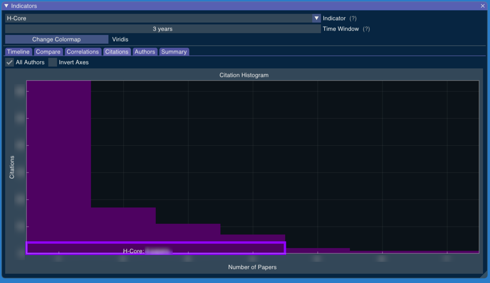

# Citations

The "Citations" tab shows the distribution of the number of citations considering all authors at once.

The histogram also shows the H-Core for this group of researchers. The H-Core is the number h of papers with at least h citations. 
 

<!-- Generated with mdsplit: https://github.com/alandefreitas/mdsplit -->
