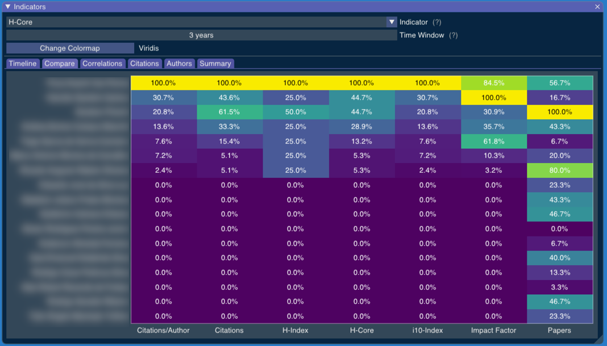

# Compare

The "Compare" tab shows us how the researchers have performed in the last years under all indicators.

The chosen indicator is used to sort results by that indicator. This helps us see if the results with the chosen indicator are much different from the results we would get from other indicators.

<!-- Generated with mdsplit: https://github.com/alandefreitas/mdsplit -->
