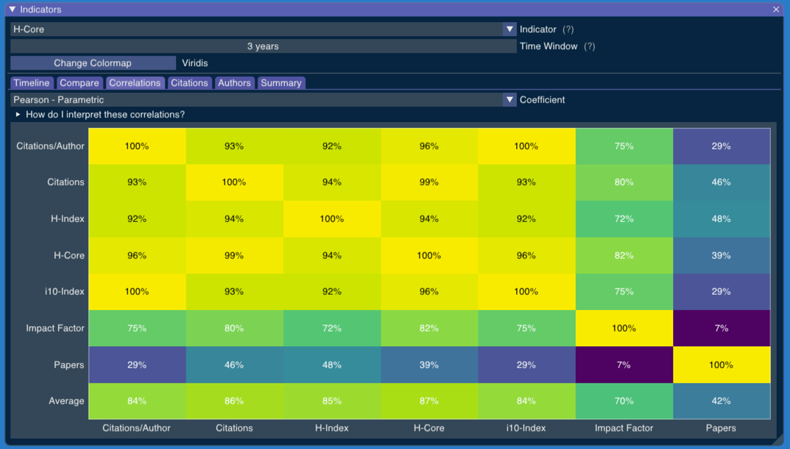
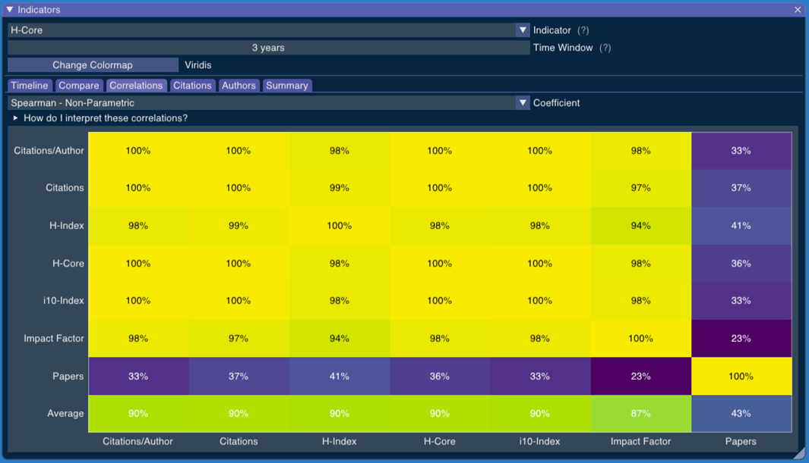

# Correlations

The "Correlations" tab shows us the similarity of results we get from the various indicators.

If we only want to know whether the indicators would give us different rankings for the researchers, we can choose a non-parametric correlation.

The last row tells us how good an indicator is at predicting all other indicators at once.

<!-- Generated with mdsplit: https://github.com/alandefreitas/mdsplit -->
