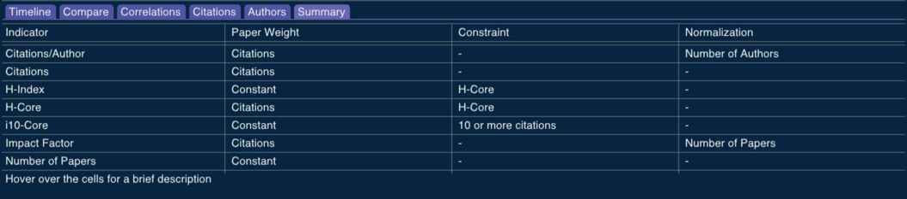

# Indicators

The bibliometric indicators are defined by (i) the weight we attribute to a paper, (ii) the constraints to even consider a paper, and (iii) the normalization strategy. The "Summary" tab includes a brief explanation for each indicator:

The indicator window can show each indicator from numerous perspectives.

<!-- Generated with mdsplit: https://github.com/alandefreitas/mdsplit -->
