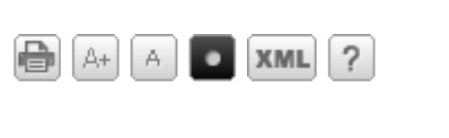

# Lattes XML

XML files are parsed as CVs from the [lattes platform](http://buscatextual.cnpq.br/buscatextual/busca.do). To download a CV in XML  format from the platform, open a CV, and use the menu on the top right.



Or simply use the URL:

```
http://buscatextual.cnpq.br/buscatextual/download.do?metodo=apresentar&idcnpq=<lattes_id>
```


<!-- Generated with mdsplit: https://github.com/alandefreitas/mdsplit -->
