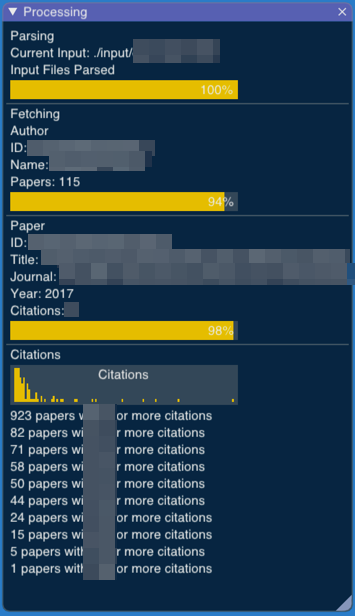

# Running BibExplorer

Use the "--input" (or "-i") option to define the input directory with CVs. For instance, if you keep the CVs in a directory `./input`, run BibExplorer with:

```bash
bibexplore --input ./input 
```

or simply

```bash
bibexplore --i ./input 
```

You can also use the `--output` (or `-o`) option to choose a directory for the results. Use the option `--help` (or `-h`) to see all other options.  Any option not provided in the command line will be replaced by an option in a `config.json` file.

BibExplorer will start processing all CVs. You can keep track of its progress with the "Processing" window:



For each paper, it will use the available APIs to look for information such as the number of citations the paper has.

As BibExplorer processes more papers, the indicators instantly become available in the "Indicators" window.


<!-- Generated with mdsplit: https://github.com/alandefreitas/mdsplit -->
