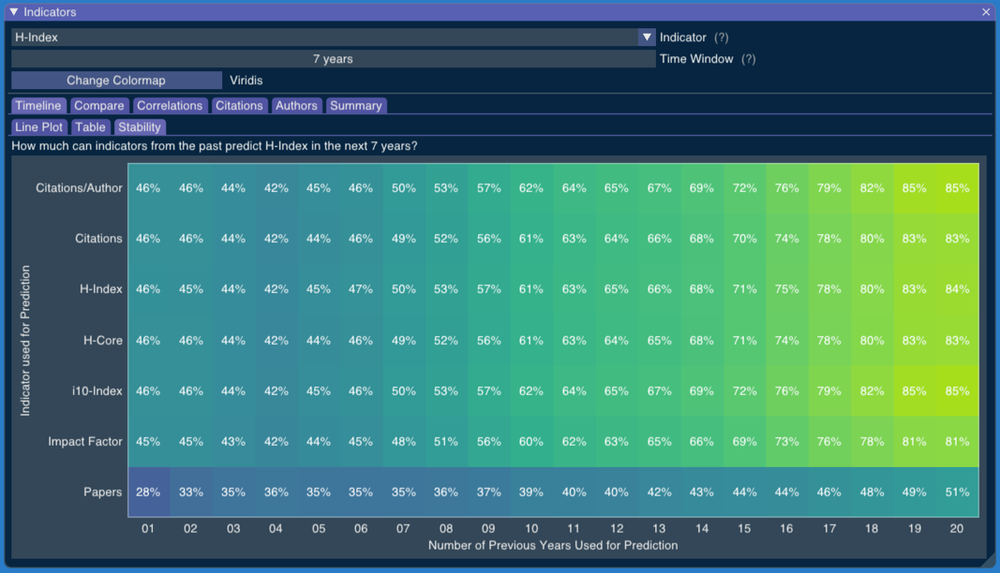

# Stability

The "Stability" tab uses historical data to show how each indicator and each possible time window would perform if we used them to predict productivity according to the chosen combination of indicator and time window. 

In the example above, we have chosen the H-Index with a time window of 7 years. Using historical data, the table shows us how each combination of indicator and time window for the last years would fare to predict the H-Index of a researcher in the next 7 years.

For instance, the row "Impact Factor" and the column "06" gives us 45%. That means the Impact Factor of a researcher in the last 6 years has a non-parametric correlation of 45% with the H-Index of this author in the following 7 years. 

If we look at the rows, we see that "Papers" is a very bad predictor of a researcher "H-Index" in the next 7 years. If we look at the columns, we see that, for our database, longer time windows have always tended to always give us a better prediction of the researcher's H-Index in the next 7 years.

<!-- Generated with mdsplit: https://github.com/alandefreitas/mdsplit -->
