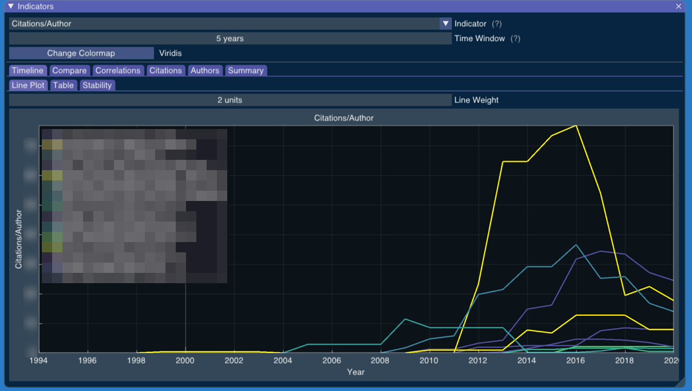
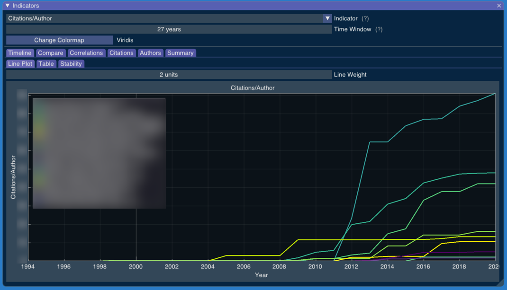

# Timeline

The "Timeline" tab shows how indicators have changed over time for each researcher.

You can adjust the "Time Window" parameter to choose how many years are considered in an indicator. 

The wider the time window, the more stable the indicators should be. A maximum time window would show how much a researcher has produced up to that year.

The "Table" tab shows the same information in a heat table, which is better for comparisons rather than absolute values.

Researchers are sorted by their indicators in the last year.

<!-- Generated with mdsplit: https://github.com/alandefreitas/mdsplit -->
