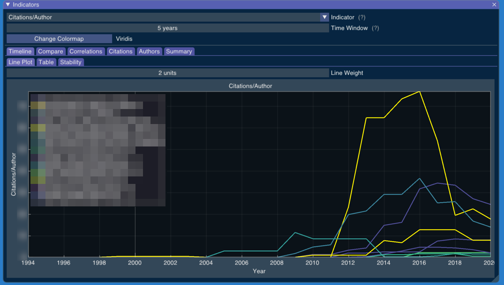

# BibExplorer 📚

> Process curricula, extract article meta-data, and calculate bibliometric indicators

 

Bibliography indicators are a crucial complement to peer reviews. The careless use of indicators reduces the motivation for high-impact publications, creates incentives for unethical practices, leads to injustices, wastes money, and consumes the time of the community. Still, adequate evaluation methods demand elaborate algorithms and treating large volumes of data from multiple data sources. BibExplorer is a tool to process curriculums, extract article meta-data from various APIs, and calculate indicators. BibExplorer can reveal how the various indicators have fluctuated over time with custom time windows, estimate which indicators adequately predict future productivity, contrast the outcomes of indicators, measure their correlation, and provide numerous visualization tools to explore this information.

 

 

<!-- https://github.com/bradvin/social-share-urls -->

 

- [Examples](examples.md)
  - [Input formats](examples/input-formats.md)
    - [CSV](examples/input-formats/csv.md)
    - [JSON](examples/input-formats/json.md)
    - [Lattes XML](examples/input-formats/lattes-xml.md)
  - [Running BibExplorer](examples/running-bibexplorer.md)
  - [Indicators](examples/indicators.md)
  - [Timeline](examples/timeline.md)
  - [Stability](examples/stability.md)
  - [Compare](examples/compare.md)
  - [Correlations](examples/correlations.md)
  - [Citations](examples/citations.md)
- [Install](install.md)
  - [Packages](install/packages.md)
  - [Build from source](install/build-from-source.md)
    - [Dependencies](install/build-from-source/dependencies.md)
    - [Build Only](install/build-from-source/build-only.md)
    - [Install from Source](install/build-from-source/install-from-source.md)
    - [Building the packages](install/build-from-source/building-the-packages.md)
- [Limitations](limitations.md)
- [Contributing](contributing.md)
  - [Contributors](contributing/contributors.md)
- [References](references.md)

<!-- Generated with mdsplit: https://github.com/alandefreitas/mdsplit -->
